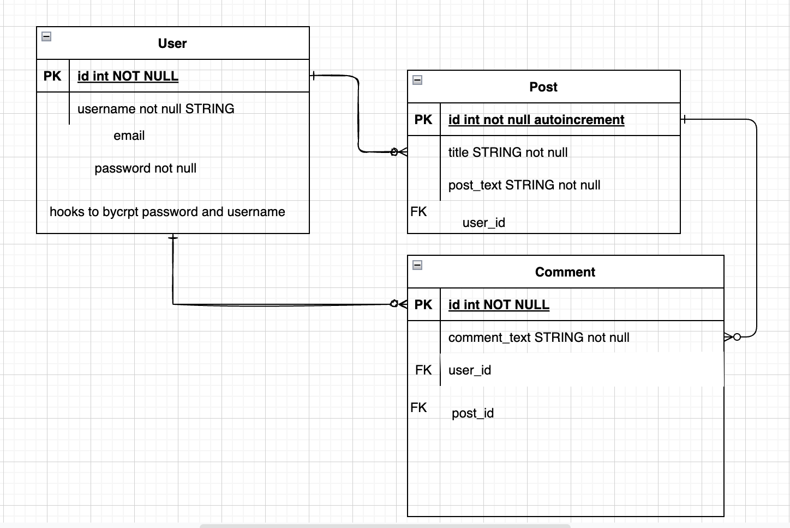
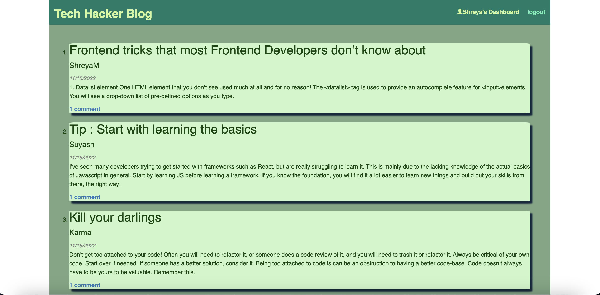

    
    
    
    
    
    
    

# Tech-Hacker

This application was created using Node.js, express for the server, and sequelize to connect to a mysql database entitled "tech_blog_db".  All user, post, and comment data is stored in tech_blog_db.  The live app is currently deployed on Heroku, using the JAWSDB add on to store data.  All passwords have been encrypted using the bcrypt Node.js package.  The HTML views templates are generated using Handlebars.js.

github- https://github.com/shreyamishra9618/Tech-Hacker
heroku- https://tech-hacker.herokuapp.com/

## Table of Contents

- [Installation](#installation)
- [Usage](#usage)
- [Example](#example)
- [Credits](#credits)
- [Questions](#questions)

## Installation
First the user needs to install npm packages, which should come with sequelize, mysql. The user needs to make sure to use mysql to get the db set and run the seeds.

## Usage
The user must make sure to run mysql to get the db and tables. Once this is done the user needs to run the seeds and get the server up and listening. From here the user can create or login to an account. After you have logged in you may post your article or comment on any other posts.

## Example

## Credits & Collaborations
The site is created by Shreya Mishra.
 
 You can find my other projects here:  [Shreya](https://github.com/shreyamishra9618)
